# RealSense MIPI Platform Driver - Probe Flow and Video Device Registration

## System Architecture Overview

### V4L2 Subdevice to I2C Address Mapping

This block diagram shows how each physical sensor is mapped to an I2C address and exposed as a V4L2 subdevice:

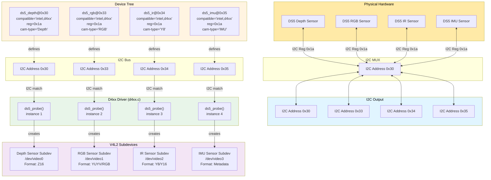

### Key Concepts:

1. **One I2C Address = One Physical Sensor**: Each D4xx sensor (depth, RGB, IR, IMU) has a unique I2C address
2. **One Probe per Sensor**: The driver's `ds5_probe()` is called separately for each I2C address match
3. **One V4L2 Subdevice per Sensor**: Each sensor type creates its own V4L2 subdevice node
4. **One MUX per Instance**: Each driver instance creates a MUX subdevice with 5 pads
5. **Device Tree Configuration**: The I2C addresses and sensor types are defined in the device tree

### Example Multi-Sensor Multi-i2c-bus Configuration:

```dts
i2c@0 {
    reg = <0x0> /* Depth sensor at i2c 30 */
    d4m_depth@1a {
        compatible = "intel,d4xx";
        def-addr = <0x10>;
        /* reg addr 0x1a */
        reg = <0x1a>;
        cam-type = "Depth";
        vcc-supply = <&vdd_1v8>;
        ...
    };
    ...
}
i2c@1 {
    reg = <0x3> /* RGB sensor at i2c 33 */
    d4m_rgb@1a {
        compatible = "intel,d4xx";
        /* reg addr 0x1a */
        reg = <0x1a>;
        cam-type = "RGB";
        vcc-supply = <&vdd_1v8>;
        ...
    };
    ...
};
i2c@2 {
    reg = <0x4> /* IR sensor at i2c 34 */
    d4m_ir@1a {
        compatible = "intel,d4xx";
        reg = <0x1a>;
        cam-type = "Y8";
        vcc-supply = <&vdd_1v8>;
        ...
    };
    ...
};
i2c@2 {
    reg = <0x5> /* IMU sensor at i2c 35 */
    d4m_imu@1a {
        compatible = "intel,d4xx";
        reg = <0x1a>;
        cam-type = "IMU";
        vcc-supply = <&vdd_1v8>;
        ...
    };
    ...
};
```

### Result in User Space:

```bash
# Each sensor appears as separate V4L2 subdevices
/dev/video0  # Depth sensor stream
/dev/video1  # Depth metadata stream
/dev/video2  # RGB sensor stream
/dev/video3  # RGB metadata stream
/dev/video4  # IR sensor stream
/dev/video5  # IR metadata stream
/dev/video6  # IMU sensor stream

# Media controller shows the complete topology
media-ctl -p -d /dev/media0
```

---

## Phase 1: Initial Probe and Power Setup
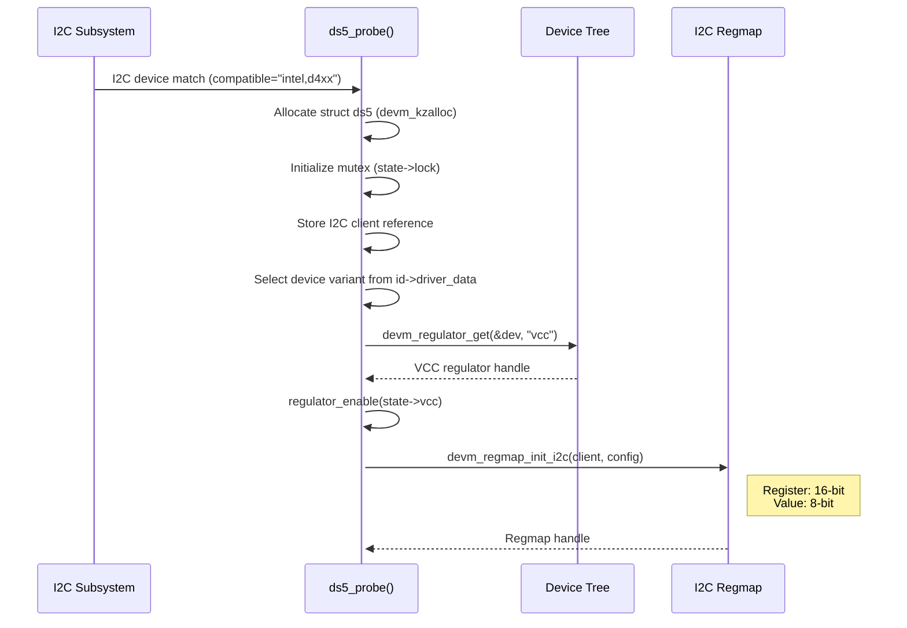

### What is I2C Device Match?

The "I2C device match" is the process where the Linux kernel’s I2C subsystem detects a device on the I2C bus that matches a driver’s compatible string, and then calls the driver's `probe` function.

#### How it works:
1. **Device Tree/Board File**: The device is described in the device tree, for example:
    ```dts
        i2c@1 { //RGB0
				status = "ok";
				reg = <0x3>; 	// line 18-19 of the I2C switch
				#address-cells = <0x1>;
				i2c-mux,deselect-on-exit;
				#size-cells = <0x0>;

				d4m1: d4m@10 {
					status = "ok";
					reg = <0x10>;
					compatible = "intel,d4xx";
					vcc-supply = <&p2822_vdd_1v8_cvb>;
					/*reset-gpios = <&tegra_main_gpio CAM0_RST_L GPIO_ACTIVE_HIG>;*/
					cam-type = "RGB";
					ports {
						#address-cells = <1>;
						#size-cells = <0>;

						port@0 {
							reg = <0>;
							d4m1_out: endpoint {
								port-index = <1>;
								bus-width = <2>;
								vc-id = <1>;
								remote-endpoint = <&csi_in1>;
							};
						};
					};
    ```
2. **Driver Table**: The driver (in `d4xx.c`) provides an `i2c_device_id` table and/or an `of_match_table`:
    ```c
    static const struct of_device_id d4xx_of_match[] = {
        { .compatible = "intel,d4xx" },
        { }
    };
    MODULE_DEVICE_TABLE(of, d4xx_of_match);
    ```
3. **Match**: When the kernel boots, it matches the device tree node to the driver’s table. If matched, it calls the driver's `probe` function (here, `ds5_probe()`).

**Summary:**
The I2C device match is the automatic association of a physical I2C device (described in hardware and device tree) with its Linux driver, triggering the driver’s initialization code.
Current implementation will have 4 d4xx instances (depth, rgb, Y8, IMU)

## Phase 2: SerDes and Device Tree Parsing
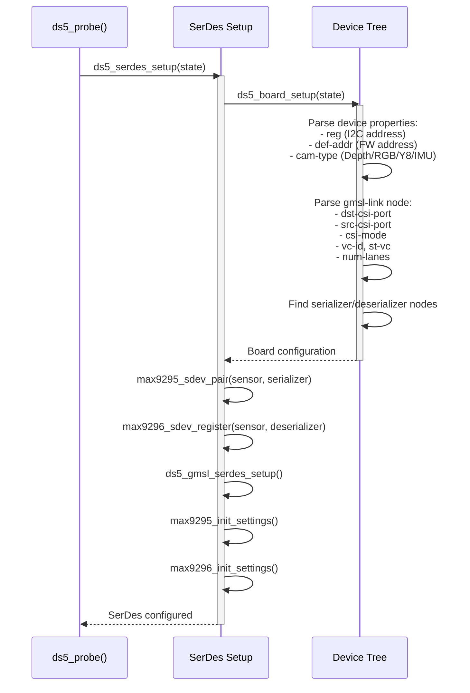

### What is SerDes Setup?

SerDes (Serializer/Deserializer) setup configures the GMSL (Gigabit Multimedia Serial Link) pipeline for transmitting camera data over long distances using differential signaling. This is essential for automotive and embedded applications where cameras are physically separated from the processing unit.

#### How it works:
1. **Device Tree Parsing**: The driver reads GMSL configuration from the device tree's `gmsl-link` node
2. **Serializer Pairing**: Associates the D4xx camera sensor with a MAX9295 serializer chip
3. **Deserializer Registration**: Registers the sensor with a MAX9296 deserializer on the host side
4. **Pipeline Configuration**: Sets up the complete data path including CSI lanes, virtual channels, and data rates

#### Example Device Tree Configuration:
```dts
d4m@10 {
    compatible = "intel,d4xx";
    reg = <0x10>;
    cam-type = "Depth";
    
    gmsl-link {
        dst-csi-port = "a";           // CSI port on deserializer side
        src-csi-port = "0";           // CSI port on serializer side  
        csi-mode = "1x4";             // 1 camera using 4 lanes
        serdes-csi-link = "a";        // GMSL link identifier
        st-vc = <0>;                  // Starting virtual channel
        vc-id = <0>;                  // Virtual channel ID for this sensor
        num-lanes = <4>;              // Number of MIPI CSI-2 lanes
    };
};
```

#### Key Functions:
- **`max9295_sdev_pair()`**: Links sensor to serializer (camera side)
- **`max9296_sdev_register()`**: Registers with deserializer (host side)
- **`ds5_gmsl_serdes_setup()`**: Configures complete GMSL pipeline
- **`max9295_init_settings()`**: Initializes serializer registers
- **`max9296_init_settings()`**: Initializes deserializer registers

**Summary:**
SerDes setup enables the RealSense camera to transmit high-bandwidth video data over long cable lengths using GMSL technology, typically used in automotive and industrial applications.

## Phase 3: Hardware Communication Verification
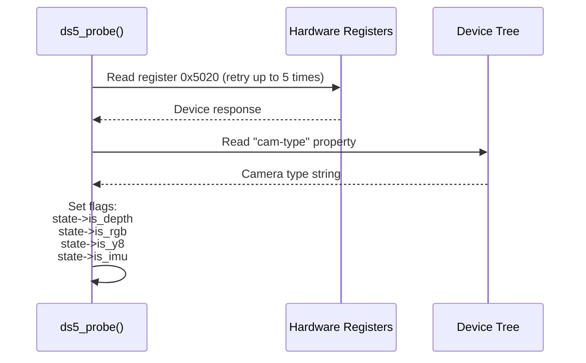

### What is Hardware Communication Verification?

This phase ensures the D4xx camera hardware is accessible via I2C and properly responding to register reads. It also determines the camera type from the device tree to configure the appropriate sensor functionality.

#### How it works:
1. **Initial I2C Test**: Reads a known register (0x5020) to verify I2C communication
2. **Retry Mechanism**: Attempts up to 5 times to handle timing issues during power-up
3. **Camera Type Detection**: Reads the `cam-type` property from device tree
4. **State Flags**: Sets internal flags based on camera type for later initialization

#### Example Code Flow:
```c
// Read register 0x5020 to verify device is responding
for (i = 0; i < 5; i++) {
    ret = regmap_read(state->regmap, 0x5020, &val);
    if (ret == 0)
        break;
    msleep(100);  // Wait 100ms before retry
}

// Read cam-type from device tree
ret = of_property_read_string(dev->of_node, "cam-type", &cam_type);

// Set appropriate flags
if (!strcmp(cam_type, "Depth"))
    state->is_depth = 1;
else if (!strcmp(cam_type, "RGB"))
    state->is_rgb = 1;
else if (!strcmp(cam_type, "Y8"))
    state->is_y8 = 1;
else if (!strcmp(cam_type, "IMU"))
    state->is_imu = 1;
```

#### Camera Type Examples:

**Depth Camera Instance:**
```dts
d4m_depth@10 {
    compatible = "intel,d4xx";
    reg = <0x10>;
    cam-type = "Depth";  // Depth sensor with laser projector
};
```

**RGB Camera Instance:**
```dts
d4m_rgb@14 {
    compatible = "intel,d4xx";
    reg = <0x14>;
    cam-type = "RGB";    // Color camera sensor
};
```

**IR Camera Instance:**
```dts
d4m_ir@18 {
    compatible = "intel,d4xx";
    reg = <0x18>;
    cam-type = "Y8";     // Infrared sensor (Y8/Y16 formats)
};
```

**IMU Instance:**
```dts
d4m_imu@1c {
    compatible = "intel,d4xx";
    reg = <0x1c>;
    cam-type = "IMU";    // Inertial Measurement Unit
};
```

#### Register 0x5020:
This is a status/identification register that:
- Returns a valid value when device is operational
- Returns 0x201 when device is in DFU (firmware update) recovery mode
- Used as the first hardware handshake test

**Summary:**
This phase validates I2C connectivity to the camera hardware and identifies the sensor type, ensuring the driver initializes the correct functionality (depth processing, RGB capture, IR streaming, or IMU data).

## Phase 4: DFU Character Device (Depth only)
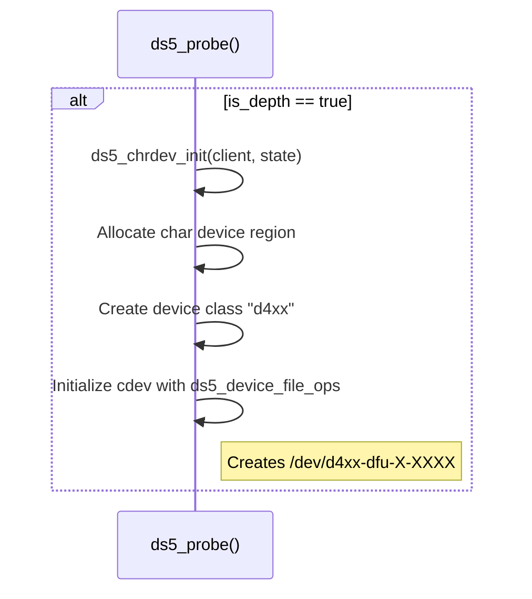

## Phase 5: Recovery Mode Check
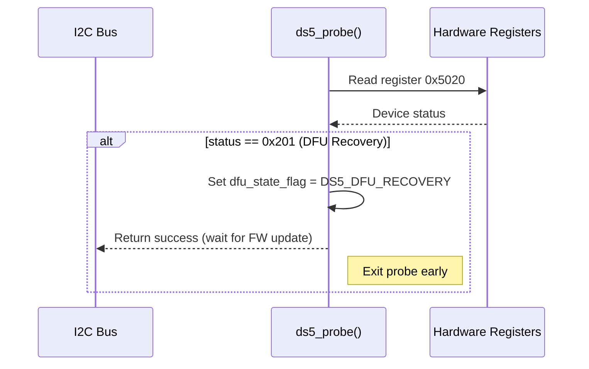

## Phase 6: Firmware Version Detection
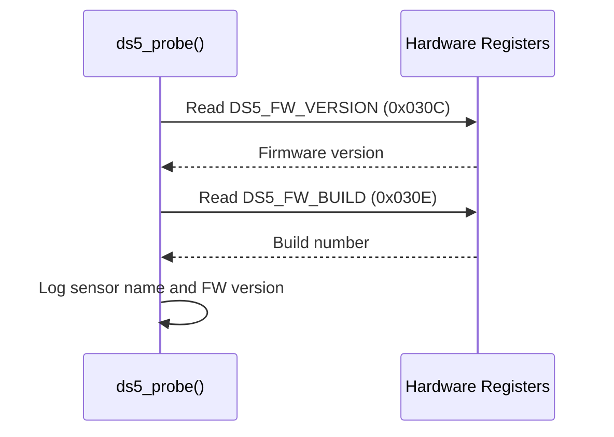

## Phase 7: V4L2 Subsystem Initialization
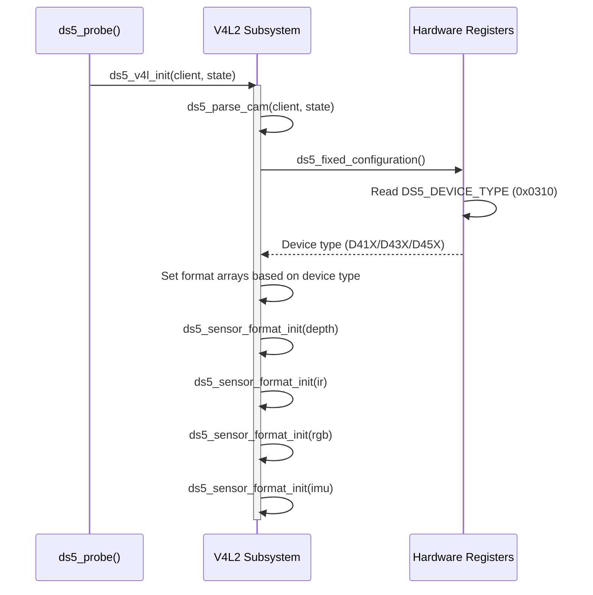

### What is V4L2 Subsystem Initialization?

V4L2 (Video for Linux 2) subsystem initialization prepares the camera driver to integrate with the Linux video capture framework. This phase reads the hardware configuration and sets up the supported video formats for each sensor type.

#### How it works:
1. **Entry Point**: `ds5_v4l_init()` is called from the probe function
2. **Hardware Detection**: Reads the device type register (0x0310) to identify the specific D4xx model
3. **Format Configuration**: Based on the detected model, assigns the appropriate format arrays to each sensor
4. **Sensor Format Init**: Initializes format lists for depth, IR, RGB, and IMU sensors

#### Device Type Detection:
```c
// Read DS5_DEVICE_TYPE register (0x0310)
ret = regmap_read(state->regmap, DS5_DEVICE_TYPE, &device_type);

switch (device_type) {
    case DS5_DEVICE_TYPE_D41X:  // D415/D410
        // Configure for D41X formats
        break;
    case DS5_DEVICE_TYPE_D43X:  // D435/D435i
        // Configure for D43X formats
        break;
    case DS5_DEVICE_TYPE_D45X:  // D455/D457
        // Configure for D45X formats
        break;
}
```

#### Format Arrays by Sensor Type:

**Depth Sensor Formats (example):**
```c
static const struct ds5_format ds5_depth_formats[] = {
    { .pixelformat = V4L2_PIX_FMT_Z16,   .depth = 16 },  // 16-bit depth
    { .pixelformat = V4L2_PIX_FMT_UYVY,  .depth = 16 },  // YUV format
};
```

**RGB Sensor Formats (example):**
```c
static const struct ds5_format ds5_rgb_formats[] = {
    { .pixelformat = V4L2_PIX_FMT_YUYV,  .depth = 16 },  // YUV 4:2:2
    { .pixelformat = V4L2_PIX_FMT_UYVY,  .depth = 16 },  // YUV 4:2:2
    { .pixelformat = V4L2_PIX_FMT_RGB565, .depth = 16 },  // RGB 5:6:5
};
```

**IR Sensor Formats (example):**
```c
static const struct ds5_format ds5_ir_formats[] = {
    { .pixelformat = V4L2_PIX_FMT_GREY,  .depth = 8 },   // Y8 grayscale
    { .pixelformat = V4L2_PIX_FMT_Y10,   .depth = 10 },  // Y10 format
    { .pixelformat = V4L2_PIX_FMT_Y12,   .depth = 12 },  // Y12 format
    { .pixelformat = V4L2_PIX_FMT_Y16,   .depth = 16 },  // Y16 format
};
```

#### Resolution Configuration:
```c
static const struct ds5_resolution ds5_sizes[] = {
    { .width = 1280, .height = 720,  .fps = 30 },
    { .width = 848,  .height = 480,  .fps = 60 },
    { .width = 640,  .height = 480,  .fps = 90 },
    { .width = 640,  .height = 360,  .fps = 90 },
    { .width = 480,  .height = 270,  .fps = 90 },
    { .width = 424,  .height = 240,  .fps = 90 },
};
```

**Summary:**
This phase detects the specific D4xx camera model and configures the supported video formats, resolutions, and frame rates for each sensor type (depth, RGB, IR, IMU), preparing the driver for V4L2 video capture operations.

## Phase 8: Individual Sensor Subdevice Initialization
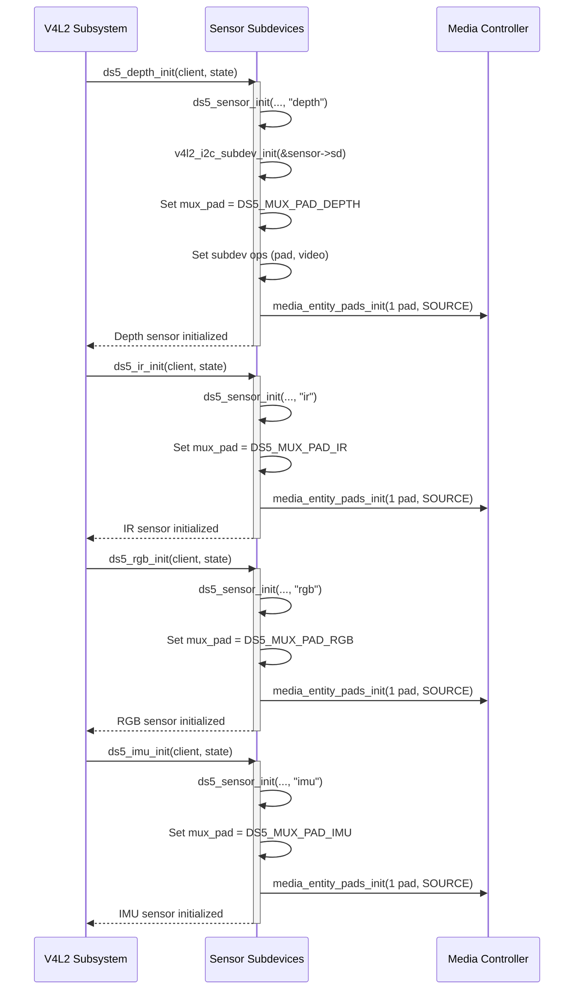

### What is Individual Sensor Subdevice Initialization?

Each sensor (depth, IR, RGB, IMU) is initialized as a separate V4L2 subdevice. This creates independent video sources that can be configured and controlled separately. The V4L2 subsystem doesn't call these subdevices during initialization—it registers them for later use during video streaming operations.

#### How it works:
1. **Subdevice Creation**: Each sensor gets its own `v4l2_subdev` structure
2. **Operations Registration**: Subdevice operations (callbacks) are registered for later use
3. **Media Pad Setup**: Each sensor gets one SOURCE pad for the media controller framework
4. **MUX Pad Assignment**: Each sensor is assigned a corresponding pad on the MUX subdevice

#### When does V4L2 call the sensor subdevice?

The V4L2 subsystem calls sensor subdevice operations in response to **user space requests** and **streaming events**, NOT during initialization:

**1. Format Negotiation (User opens video device):**
```c
// User space calls: ioctl(fd, VIDIOC_S_FMT, &fmt)
// V4L2 framework calls:
static int ds5_sensor_set_fmt(struct v4l2_subdev *sd,
                             struct v4l2_subdev_pad_config *cfg,
                             struct v4l2_subdev_format *fmt)
{
    // Validate and set format (resolution, pixel format)
    // Called when application sets video format
}
```

**2. Streaming Start/Stop (User starts capture):**
```c
// User space calls: ioctl(fd, VIDIOC_STREAMON, &type)
// V4L2 framework propagates through media pipeline:
// Platform driver (Tegra VI) -> MUX -> Active Sensor

static int ds5_sensor_s_stream(struct v4l2_subdev *sd, int enable)
{
    if (enable) {
        // Configure hardware registers
        // Start camera streaming
        ds5_configure(state);
        // Write to DS5_START_STOP_STREAM register
    } else {
        // Stop camera streaming
    }
}
```

**3. Control Changes (User adjusts camera settings):**
```c
// User space calls: ioctl(fd, VIDIOC_S_CTRL, &control)
// V4L2 framework calls:
static int ds5_s_ctrl(struct v4l2_ctrl *ctrl)
{
    switch (ctrl->id) {
        case V4L2_CID_EXPOSURE_ABSOLUTE:
            // Set exposure time
            break;
        case V4L2_CID_ANALOGUE_GAIN:
            // Set sensor gain
            break;
        // ... other controls
    }
}
```

**4. Frame Interval Configuration:**
```c
// User space calls: ioctl(fd, VIDIOC_S_PARM, &parm)
// V4L2 framework calls:
static int ds5_sensor_s_frame_interval(struct v4l2_subdev *sd,
                                       struct v4l2_subdev_frame_interval *fi)
{
    // Set frame rate (fps)
}
```

#### Subdevice Operations Structure:
```c
static const struct v4l2_subdev_video_ops ds5_sensor_video_ops = {
    .s_stream = ds5_sensor_s_stream,           // Called on stream start/stop
    .g_frame_interval = ds5_sensor_g_frame_interval,  // Get frame rate
    .s_frame_interval = ds5_sensor_s_frame_interval,  // Set frame rate
};

static const struct v4l2_subdev_pad_ops ds5_sensor_pad_ops = {
    .enum_mbus_code = ds5_sensor_enum_mbus_code,      // Enumerate formats
    .enum_frame_size = ds5_sensor_enum_frame_size,    // Enumerate resolutions
    .enum_frame_interval = ds5_sensor_enum_frame_interval, // Enumerate fps
    .get_fmt = ds5_sensor_get_fmt,                    // Get current format
    .set_fmt = ds5_sensor_set_fmt,                    // Set format
};

static const struct v4l2_subdev_ops ds5_sensor_subdev_ops = {
    .video = &ds5_sensor_video_ops,
    .pad = &ds5_sensor_pad_ops,
};
```

#### Example Timeline - When Operations Are Called:

```
Initialization (Phase 8):
    └─> ds5_depth_init()
        └─> ds5_sensor_init()
            └─> v4l2_i2c_subdev_init(&sensor->sd, &ds5_sensor_subdev_ops)
                └─> Registers operations, but DOESN'T call them

User Space Application Flow:
    1. open("/dev/video0")               → No sensor callbacks yet
    2. ioctl(VIDIOC_ENUM_FMT)            → .enum_mbus_code() called
    3. ioctl(VIDIOC_ENUM_FRAMESIZES)     → .enum_frame_size() called
    4. ioctl(VIDIOC_S_FMT)               → .set_fmt() called
    5. ioctl(VIDIOC_S_PARM)              → .s_frame_interval() called
    6. ioctl(VIDIOC_S_CTRL) [exposure]   → ds5_s_ctrl() called
    7. ioctl(VIDIOC_STREAMON)            → .s_stream(1) called ★ HARDWARE STARTS
    8. [Video frames flowing...]
    9. ioctl(VIDIOC_STREAMOFF)           → .s_stream(0) called ★ HARDWARE STOPS
```

#### Each Sensor's Role:

**Depth Sensor Subdevice:**
- Provides Z16 (16-bit depth) data
- Connected to MUX pad `DS5_MUX_PAD_DEPTH`
- Controlled via `/dev/videoX`

**IR Sensor Subdevice:**
- Provides Y8/Y16 infrared data
- Connected to MUX pad `DS5_MUX_PAD_IR`
- Shares laser projector with depth sensor

**RGB Sensor Subdevice:**
- Provides color video (YUYV, RGB formats)
- Connected to MUX pad `DS5_MUX_PAD_RGB`
- Independent color camera sensor

**IMU Sensor Subdevice:**
- Provides accelerometer and gyroscope data
- Connected to MUX pad `DS5_MUX_PAD_IMU`
- Different data path (metadata, not video frames)

**Summary:**
Phase 8 creates and registers four independent V4L2 subdevices but doesn't invoke their operations. The V4L2 framework calls these subdevice operations later when user space applications open video devices, configure formats, adjust controls, or start/stop streaming. The actual hardware configuration and streaming happens during these runtime callbacks, not during initialization.

## Phase 9: MUX Subdevice Initialization
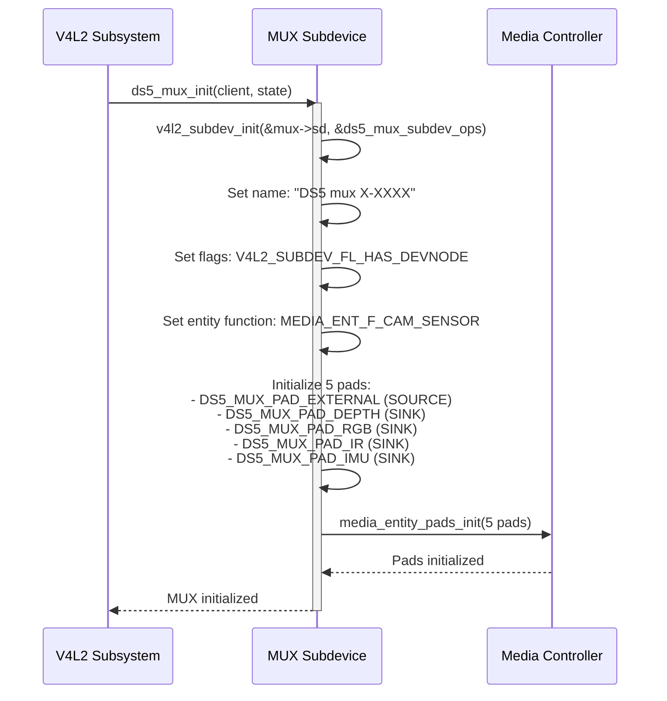

## Phase 10: Control Handler Initialization
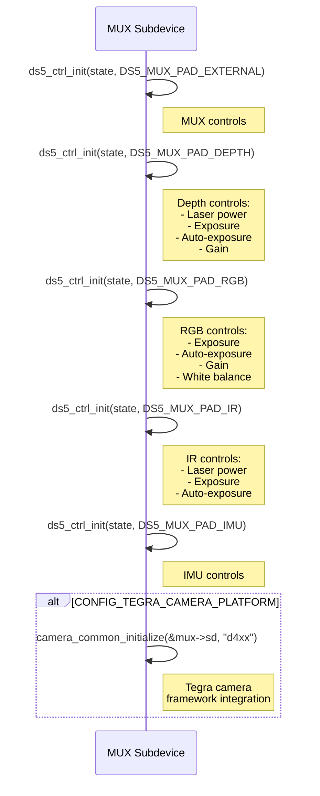

## Phase 11: Hardware Initialization
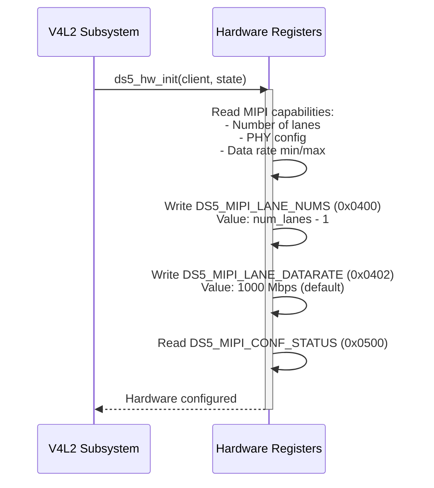

## Phase 12: MUX Registration (Async)
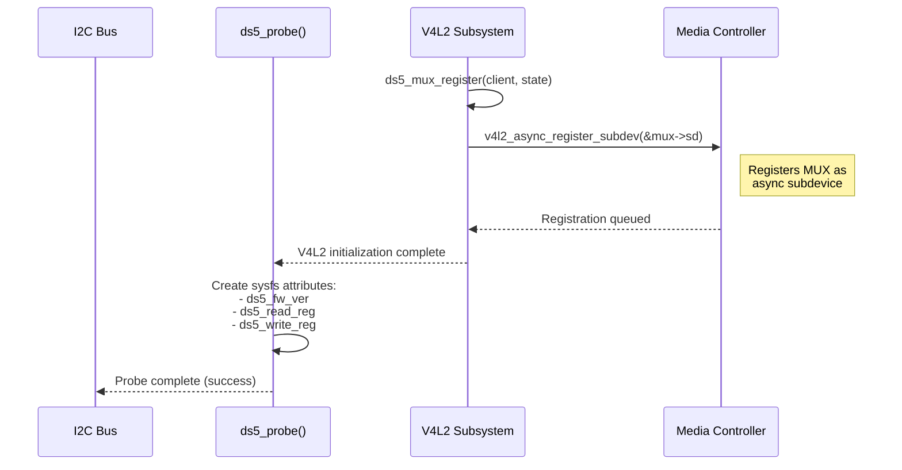

## Phase 13: Async Callback - Sensor Registration and Linking
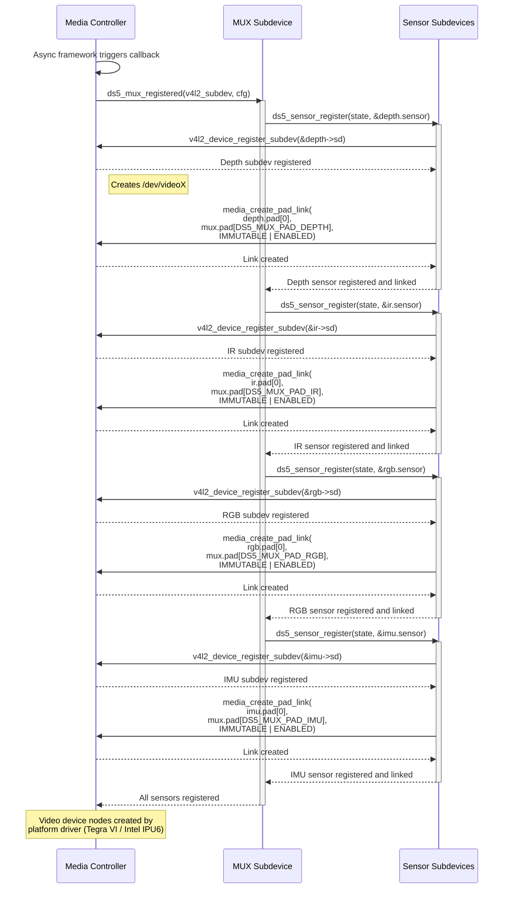

## Device Tree Integration

The driver parses critical device tree properties during initialization:

### Device Node Properties
```dts
d4xx@1a {
    compatible = "intel,d4xx";
    reg = <0x1a>;              // I2C slave address
    def-addr = <0x10>;         // Default firmware address
    cam-type = "Depth";        // Camera type: "Depth", "RGB", "Y8", "IMU"
    vcc-supply = <&battery_reg>;
};
```

### GMSL Link Configuration (SerDes Mode)
```dts
gmsl-link {
    dst-csi-port = "a";        // Destination CSI port
    src-csi-port = "0";        // Source CSI port
    csi-mode = "1x4";          // CSI mode: 1x4, 2x4, 4x2, 2x2
    serdes-csi-link = "a";     // SerDes CSI link
    st-vc = <0>;               // Start virtual channel
    vc-id = <0>;               // Virtual channel ID
    num-lanes = <4>;           // Number of MIPI lanes
};
```

## Media Controller Graph

The final media controller topology:

```
┌─────────────┐     ┌─────────────┐     ┌─────────────┐
│ Depth Sensor│────▶│             │     │             │
│   subdev    │     │             │     │   CSI-2 RX  │
└─────────────┘     │             │     │   (Platform │
                    │             │     │    Driver)  │
┌─────────────┐     │             │     │             │
│  IR Sensor  │────▶│  DS5 MUX    │────▶│             │
│   subdev    │     │   subdev    │     └─────────────┘
└─────────────┘     │             │            │
                    │  (5 pads)   │            ▼
┌─────────────┐     │             │     ┌─────────────┐
│ RGB Sensor  │────▶│             │     │  Video Input│
│   subdev    │     │             │     │  Processor  │
└─────────────┘     │             │     │  (VI/IPU6)  │
                    │             │     └─────────────┘
┌─────────────┐     │             │            │
│ IMU Sensor  │────▶│             │            ▼
│   subdev    │     │             │     ┌─────────────┐
└─────────────┘     └─────────────┘     │ /dev/videoX │
                                        └─────────────┘
```

## Streaming Flow (Runtime)

When an application starts streaming:

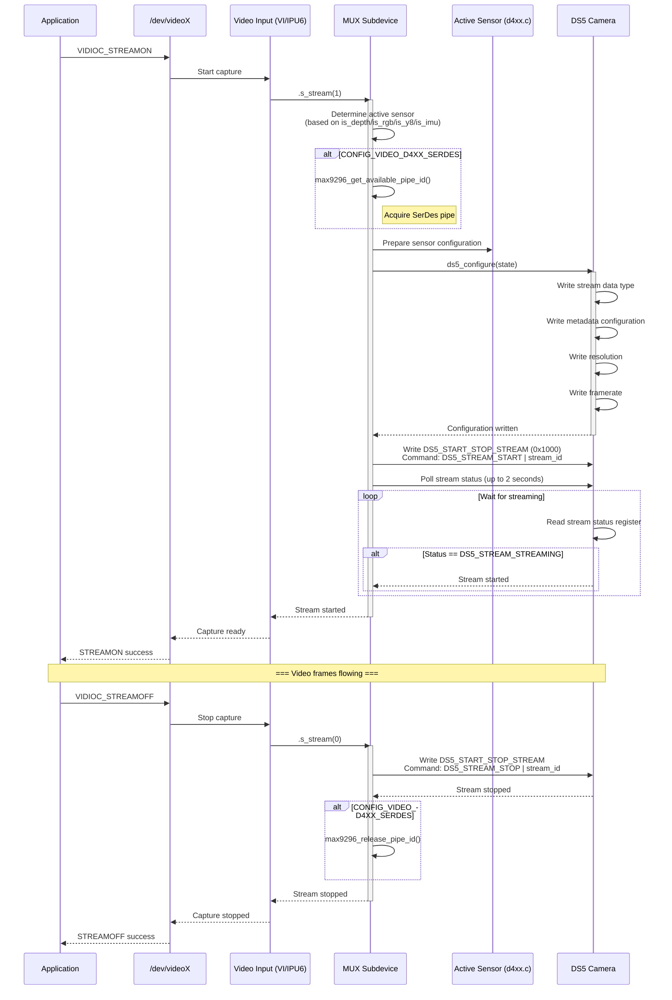

## Key Data Structures

### Main State Structure
```c
struct ds5 {
    struct {
        struct ds5_sensor sensor;
    } depth, ir, rgb, imu;
    
    struct {
        struct ds5_mux_subdev sd;
        struct media_pad pads[DS5_MUX_PAD_COUNT];  // 5 pads
        struct ds5_sensor *last_set;
    } mux;
    
    struct ds5_ctrls ctrls;
    struct ds5_dfu_dev dfu_dev;
    struct i2c_client *client;
    struct regmap *regmap;
    struct regulator *vcc;
    
    // SerDes members
    struct gmsl_link_ctx g_ctx;
    struct device *ser_dev;
    struct device *dser_dev;
    
    // Flags
    bool is_depth;
    bool is_rgb;
    bool is_y8;
    bool is_imu;
};
```

### Sensor Structure
```c
struct ds5_sensor {
    struct v4l2_subdev sd;
    struct media_pad pad;           // Single SOURCE pad
    struct v4l2_mbus_framefmt format;
    u16 mux_pad;                    // Corresponding mux pad
    
    struct {
        const struct ds5_format *format;
        const struct ds5_resolution *resolution;
        u16 framerate;
    } config;
    
    bool streaming;
    const struct ds5_format *formats;
    unsigned int n_formats;
    int pipe_id;                    // SerDes pipe ID
};
```

### MUX Pads
```c
enum {
    DS5_MUX_PAD_EXTERNAL = 0,  // SOURCE - to CSI-2
    DS5_MUX_PAD_DEPTH,         // SINK - from depth sensor
    DS5_MUX_PAD_RGB,           // SINK - from RGB sensor
    DS5_MUX_PAD_IR,            // SINK - from IR sensor
    DS5_MUX_PAD_IMU,           // SINK - from IMU sensor
    DS5_MUX_PAD_COUNT
};
```

## Control Handlers

Each sensor and the MUX have dedicated V4L2 control handlers:

### Common Controls (All Sensors)
- `V4L2_CID_ANALOGUE_GAIN` - Analog gain
- `V4L2_CID_EXPOSURE_ABSOLUTE` - Exposure time
- `V4L2_CID_EXPOSURE_AUTO` - Auto-exposure mode

### Depth/IR Specific Controls
- Custom laser power control
- Manual laser power control
- Auto-exposure ROI (Region of Interest)

### RGB Specific Controls
- `V4L2_CID_AUTO_WHITE_BALANCE` - Auto white balance
- `V4L2_CID_WHITE_BALANCE_TEMPERATURE` - Color temperature

### MUX Controls
- Firmware version (read-only)
- Hardware monitor commands (HWMC)
- Calibration data get/set
- IPU6 link frequency and sub-stream configuration

## Error Handling and Recovery

### Probe Failures
1. **Regulator not available** → Return error, probe fails
2. **I2C communication timeout** → Retry up to 5 times, then fail
3. **SerDes devices not ready** → Return `-EPROBE_DEFER`, kernel will retry
4. **Recovery mode detected (0x201)** → Exit probe successfully, create DFU device only

### Runtime Errors
1. **Streaming timeout** → Send stop command, return `-EAGAIN`
2. **Invalid format requested** → Return `-EINVAL`
3. **SerDes link failure** → Release resources, return error to user space
